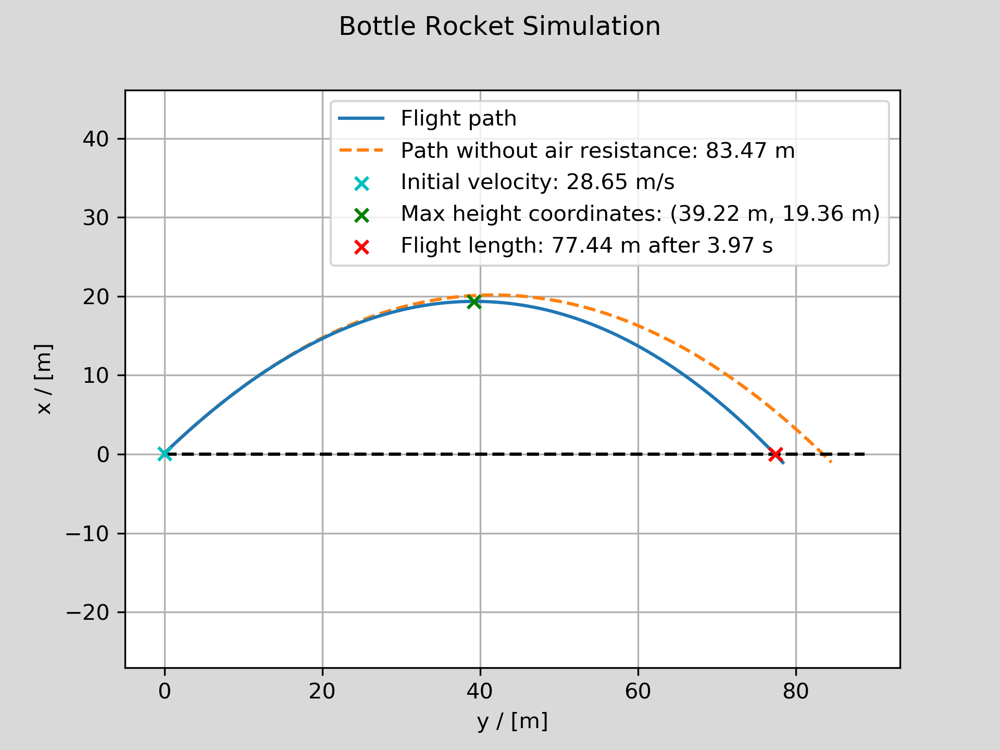

# Bottle rocket simulator
Simulates the path of a bottle rocket given initial parameters. The purpose of the project is to optimize parameters and estimate the flight length of a built bottle rocket, see `Bottle_Rocket_Estimation.pdf`.

## Prerequisites

- Python 3
- Matplotlib
- Numpy

## Usage

- Clone the repository, run `main.py`. A plot will be generated as `result.png` displaying trajectory and length.
- Given parameters (such as *pover*, *mbottle*, *mwater*, *Vbottle*, *Vwater*) can easily be changed in `bottle_rocket_simulator.py`.
- The method `optimize` in `BottleRocketSimulator` can be used to find the optimal initial values of *αinitial* and *Vwater*.

## Method

1. The initial velocity (ΔV) is approximated using starting parameters.
2. Trajectory is approximated with iterated steps given drag and gravity parameters.

## Result

## TODOs

- [ ] Make better approximation of initial velocity. This could be done by including the thrust from the remaining air in the bottle after the water has been ejected.
